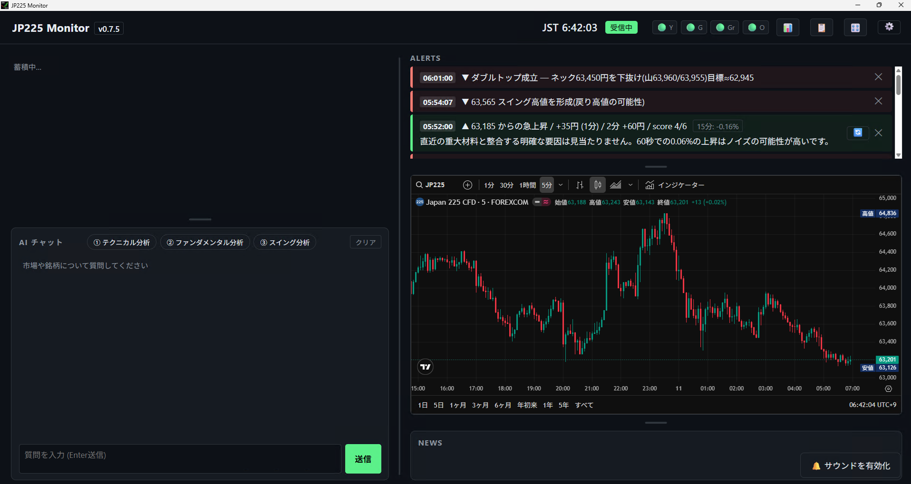

# JP225 Monitor

JP225 の価格変動をリアルタイムに監視し、1 分・5 分の適応 z-score (+日経 225 専用 5〜10 秒 tick) で急変動を感知し、AI がその原因を考察する Windows デスクトップアプリです。疑問点は、AI とチャット可能です。

## ✨ ダウンロード

**[最新版をダウンロード →](https://github.com/sora-moyou/jp225-monitor/releases/latest)**

「Assets」セクションから `JP225.Monitor_X.X.X_x64-setup.exe` をクリック。

## 📖 使い方

**👉 [利用マニュアル (Web 版)](https://sora-moyou.github.io/jp225-monitor/USER_GUIDE.html)**

または [USER_GUIDE.md (markdown 版)](./USER_GUIDE.md) — 同じ内容のテキスト版。

初心者向けに、インストール → API キー設定 → 各機能の使い方 → トラブルシューティングまで網羅しています。

## ✨ 主な機能

- 📊 **8 銘柄リアルタイム監視** (NIY=F, NQ=F, YM=F, ES=F, JPY=X, CL=F, ^VIX, ^TNX) を 2 秒間隔で
- 🚨 **適応 z-score 急変検知** (1 分 burst + 5 分 trend + 日経 225 専用 5〜10 秒 tick) — v0.3.19 以降アラートは日経225先物 (NIY=F) のみ、他銘柄は横断確認・AI 材料に
- 🤖 **LLM 自動説明** (Gemini → Groq → OpenAI 自動フォールバック、無料枠で十分) — 急変時は大きく動いた他資産 (|z|≥4.0) も判断材料に
- 📰 **21 ニュースソース集約** (日本 7 + 英語 14)、英語見出しはワンクリック日本語翻訳
- 💬 **AI チャット**: 全銘柄価格 + 直近ニュース + 日経225先物テクニカル要約をコンテキストに自由質問。ワンタップ定型質問 (① トレンド方向と上値/下値メド ② 急変の理由) 付き
- 📈 **TradingView チャート埋め込み** (日経 225)
- 🔔 **音声アラート** (Web Audio API、上昇=高音/下落=低音)
- 🔄 **自動アップデート** (起動 5 秒後にチェック、新版あれば右上トースト / 設定画面「最新かチェック」で手動確認も) — v0.3.3 でインストール時ファイルロック問題解消
- 🎛 **レイアウト調整**: パネル境界のドラッグで各欄の高さ・左右カラムの幅を可変。API ポーリング間隔も設定可、稼働状況を topbar 可視化

## 🖼 スクリーンショット

左から: 価格カード (日経225先物 / WTI原油) → TradingView チャート (3 分足) → AI チャット。右に急変アラート 3 件 (15 分文脈 + LLM 説明) と日英ニュース。トップバーには相関リーダー、API 稼働ドット、ログ・設定ボタン。

## 🛠 動作環境

- **Windows 10 / 11** (64-bit)
- **WebView2 Runtime** (Win 11 標準同梱、Win 10 でも近年の Windows Update で含まれる)
- **LLM API キー** (Gemini 推奨、無料): https://aistudio.google.com/apikey

API キー未設定でも価格監視・アラート音・チャートは動きます。AI 説明と AI チャットだけが無効になります。

## 🧰 開発者向け

ソースからビルド、テスト、リリース手順、アーキテクチャ、ライセンス、サポートについては **[DEVELOPMENT.md](./DEVELOPMENT.md)** を参照してください。
